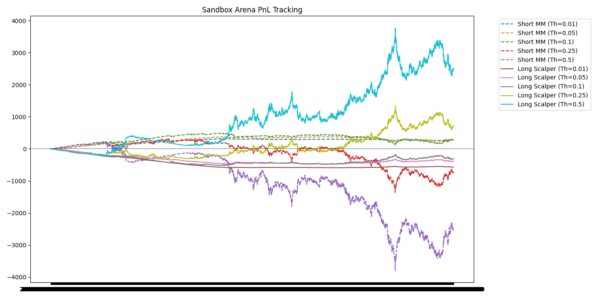
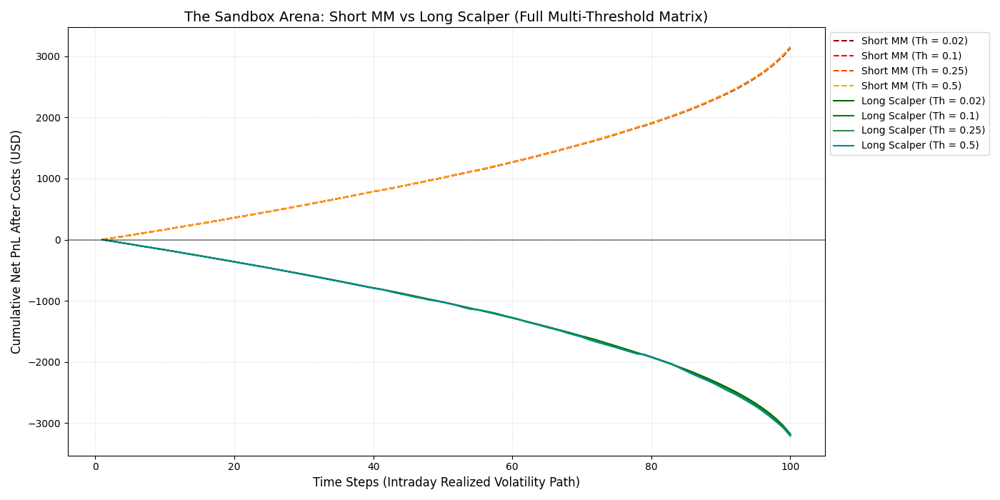
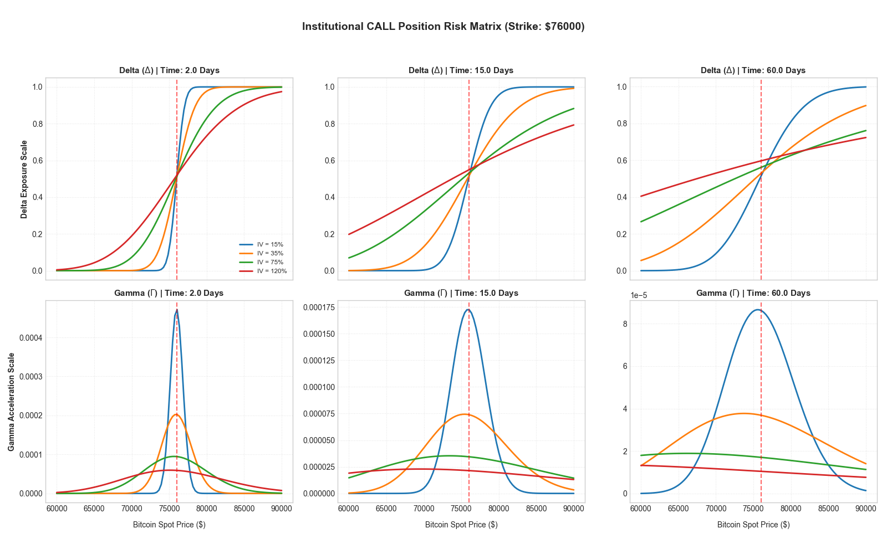
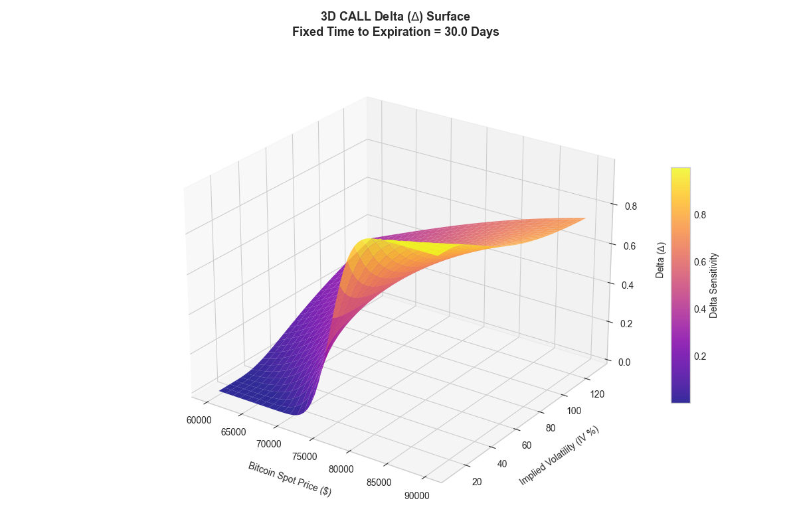
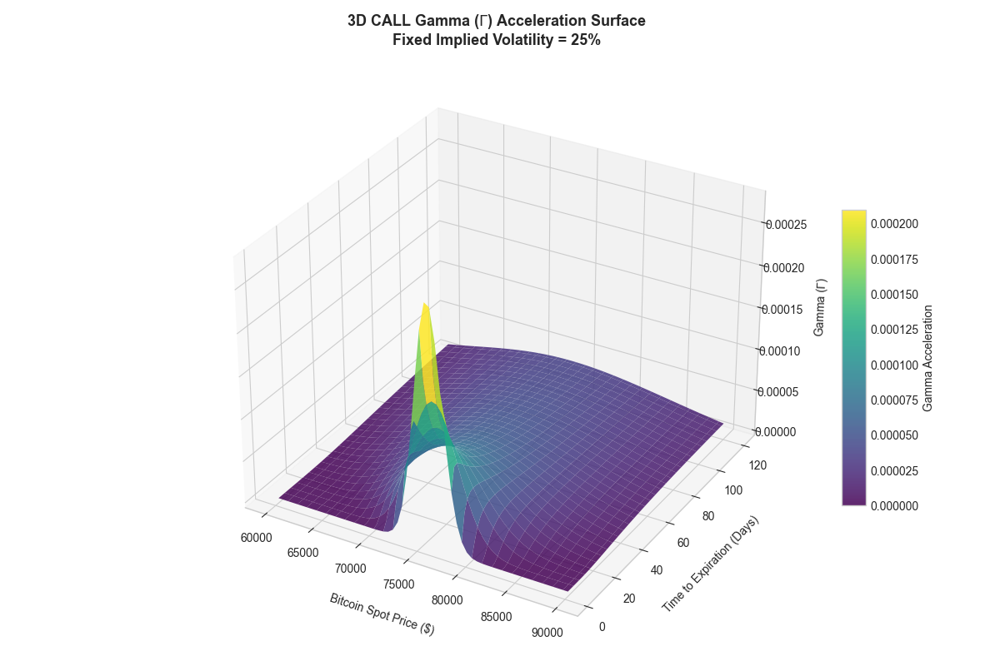
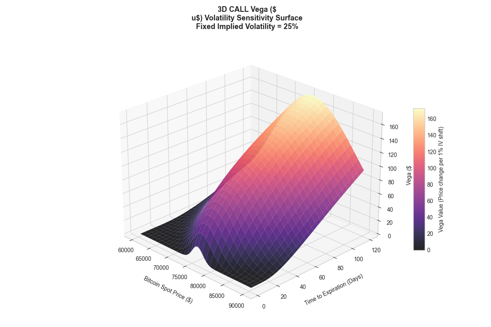

# Options Dynamic Hedging & Volatility Sandbox Arena

This project explores how different delta-hedging policies affect portfolio risk, trading activity, transaction costs, and profitability for an options market maker or volatility trader.

Rather than treating Greeks as static textbook quantities, the project investigates how changing option exposures drive real hedging decisions over time.

This repository simulates a dynamic battlefield between a **Short Straddle Market Maker and Multi-Threshold Gamma Scalper** (Positive Gamma) using continuous Black-Scholes Greek replication.

---

## 🚀 Installation & Quick Start

```bash
# Clone the repository
git clone [https://github.com/Benson0914/options-dynamic-hedging-sandbox.git](https://github.com/Benson0914/options-dynamic-hedging-sandbox.git)
cd options-dynamic-hedging-sandbox

# Install required mathematical & plotting frameworks
pip install -r requirements.txt

# Run the full Multi-Threshold Arena Simulation Matrix
python run_arena.py
```

### The framework combines:

- Black-Scholes pricing
- Greeks calculation
- Delta hedging simulation
- Threshold-based hedge execution
- Transaction cost modeling
- Gamma scalping analysis
- PnL attribution

The primary research question is:
**How often should an options position be hedged once transaction costs are introduced?**

# **Research Motivation**

In theory, continuous delta hedging minimizes directional risk.

In practice, every hedge generates trading costs, execution risk, and operational complexity.

This creates a trade-off:

- Hedge too frequently → higher transaction costs
- Hedge too infrequently → larger residual delta exposure

The goal of this project is to quantify that trade-off and evaluate whether less frequent hedging can achieve similar portfolio outcomes.

# **Research Questions**

1. How sensitive is portfolio performance to hedge frequency?
2. How do transaction costs change across hedge thresholds?
3. How much residual risk is introduced by reducing hedge activity?
4. Can threshold-based hedging deliver similar outcomes with fewer trades?
5. How do Greeks evolve as expiration approaches?
6. Under what conditions does gamma scalping become profitable?

## **Hedging Framework**
```
Market Data
↓
Option Pricing
↓
Greeks Engine
↓
Delta Exposure Calculation
↓
Threshold-Based Hedging
↓
Transaction Cost Model
↓
PnL Attribution
```
## **Threshold Hedging Results**

A hedge is executed only when absolute portfolio delta exceeds a predefined threshold.

Examples:
- Threshold = 0.01 → almost continuous hedging
- Threshold = 0.10 → moderate hedging
- Threshold = 0.50 → infrequent hedging

Live BTC Backtest Results
|Threshold|	Hedge Count|	Avg Delta Exposure|	Transaction Cost|	Final PnL|
| -------- | ------------- |------------- |------------- |------------- |
|0.01|	50|	0.0200|	$36.45|	$2682.05|
|0.05|	18|	0.0323|	$30.09|	$2664.01|
|0.10|	6|	0.0403|	$19.10|	$2685.52|
|0.25|	3|	0.0693|	$19.10|	$2673.17|
|0.50|	1|	0.1214|	$11.05|	$2593.25|

# **Key Findings**

The relationship between hedge frequency and profitability was weaker than expected.

Reducing hedge activity significantly lowered trading frequency and transaction costs, while final portfolio PnL remained broadly stable across a wide range of thresholds.

For example:

- Hedge executions fell from 50 to 6 trades when moving from a 0.01 threshold to a 0.10 threshold.
- Transaction costs fell by almost 50%.
- Final PnL remained largely unchanged.

This suggests that, over the tested period, increasing hedge precision produced limited incremental benefit.

The results highlight an important practical observation:

**More hedging is not necessarily better hedging.**

## 1/6/2026 - 4/6/2026 Crypto Big Drawdown Backtesting

Recent BTC drop from $74000 to $64000 in June and in high volatility.
Which provided an interesting stress test for a delta-hedged options.

My initial expectation was straightforward:
Lower thresholds → more hedging, higher transaction costs
Higher thresholds → fewer hedges, lower transaction costs

However, the results revealed something more interesting.

Under moderate thresholds (0.01–0.10), reducing hedge frequency had limited impact on overall PnL:
| Threshold | Short Straddle PnL |
|-----------|--------------------|
| 0.01          | +277   |
| 0.05          | +291   |
| 0.10          | +265   |

But beyond a certain point, the dominant risk changed.

| Threshold | Short Straddle PnL |
|-----------|--------------------|
| 0.25          | -744   |
| 0.50          | -2526|

The issue was no longer transaction costs. It became unhedged gamma exposure.
During large realized moves, the savings from reduced hedging were overwhelmed by accumulated directional risk.

Interestingly, the same regime shift produced the opposite effect for long gamma strategies:

| Threshold | Long Gamma PnL |
|-----------|--------------------|
| 0.25          | +711   |
| 0.50          | +2504 |



## **Delta Hedging**

The simulator dynamically rebalances perpetual futures positions to offset option delta exposure.

Tracked metrics include:

- Portfolio delta
- Hedge inventory
- Trading frequency
- Transaction costs
- Portfolio PnL

The framework allows direct comparison between continuous-style hedging and threshold-based policies.


# **Greeks Analysis**

The project includes a full Black-Scholes Greeks engine used to generate sensitivity surfaces across time and volatility.

Greeks are not presented as standalone calculations; they serve as the foundation for hedge decision-making.

# **Delta and Gamma Change in differenct time and volatility**



# **Delta Surface**



Observations:

- ATM options exhibit the most rapid changes in delta.
- Delta sensitivity increases as expiration approaches.
- Small spot moves can generate significant hedge adjustments.

# **Gamma Surface**


Observations:

- Gamma peaks near ATM strikes.
- Gamma accelerates sharply close to expiry.
- High gamma environments require more active hedging.

# **Vega Surface**



Observations:

- Longer-dated options carry larger volatility exposure.
- Vega declines rapidly as maturity approaches.

# **Gamma Scalping**

The project also evaluates a long-gamma strategy through repeated delta rebalancing.

The objective is to study how realized volatility can be harvested through dynamic hedging.

Tracked components:

- Option PnL
- Hedge PnL
- Transaction costs
- Net portfolio performance

# **PnL Attribution**

Portfolio performance is decomposed into:

Portfolio PnL

= Option PnL

- Hedge PnL
- Transaction Costs

This allows the contribution of hedging activity and execution costs to be analyzed separately.

# **Limitations**

This project should be viewed as an exploratory hedging study rather than a statistically conclusive trading strategy.

Current limitations include:

- Single underlying asset (BTC)
- Short backtest horizon
- Constant implied volatility assumption
- Black-Scholes framework
- Limited market regime coverage

As a result, the findings should be interpreted as insights into hedging dynamics rather than evidence of an optimal trading rule.

# **Future Work**

Potential extensions include:

- Longer historical backtests
- Multiple volatility regimes
- Volatility risk premium analysis
- Stochastic volatility models
- Local volatility surfaces
- Portfolio-level hedging
- Multi-option inventory management

# **Technologies**

- Python
- NumPy
- Pandas
- SciPy
- Matplotlib

# **Key Takeaway**

The project demonstrates that option hedging is fundamentally a decision-making problem rather than a pricing problem.

While Greeks quantify risk exposure, portfolio outcomes depend on how, when, and how often those risks are managed.

The results suggest that reducing hedge activity can materially lower operational costs while preserving similar portfolio outcomes, highlighting the practical trade-offs faced by options market makers and volatility traders.
